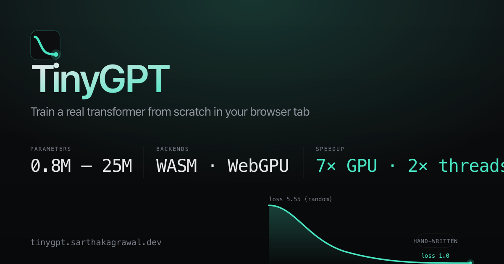

# TinyGPT

A GPT-2-shaped transformer, written from scratch and trained **in your browser
tab** — **2.6× → 12.1× faster** than the multi-threaded WebAssembly baseline
thanks to hand-written WebGPU kernels. The speedup is a curve, not a single
number: GPU work amortizes better as `d_model` grows. Parity-tested to within
2.5% loss drift across the curve.

Python reference, hand-written C++/WASM, hand-written WGSL — the same model at
three levels, with every gradient pinned down by a test.

**[Live playground →](https://tinygpt.sarthakagrawal.dev)**
· [Speedup chart](browser/speedup.html)
· [Devlog](browser/devlog.html)
· [Roadmap](browser/roadmap.html)



There is also a **native macOS app** — same model, same `.tinygpt` file
format, no browser ceiling. It additionally loads any HuggingFace
open-weight Llama-architecture model (SwiGLU + RoPE + GQA + RMSNorm +
BPE) and LoRA-fine-tunes it on local text in minutes. The first
end-to-end fine-tune cut held-out perplexity by 32% with a 788 KB
adapter. Build instructions below.

## Why this exists

It started as a teaching project — the goal was to build the whole modern LLM
stack at a size where nothing stays a black box. Every backward pass is derived
by hand, every kernel is parity-checked against a reference, no autograd engine
is involved on the C++/WebGPU side.

Somewhere along the way it became a performance project. The interesting work
stopped being "does the maths come out right" and started being "how fast can
this model train inside a browser tab, without lying about the numbers." Most
of what's in [`browser/devlog.html`](browser/devlog.html) is that second half.

## Key measured numbers

All on the same Apple M-series laptop, same model, same seed, same data.
Reproducible from the playground's bench button or `tests/test_webgpu_train.mjs`.

- **End-to-end speedup curve, WebGPU vs multi-thread WASM SIMD** — Small
  (d=96) 2.6×, Medium (d=128) 6.8×, Large (d=192) 9.3×, XL (d=256) 12.1×.
  The curve trends upward because the blocked-4×4 matmul kernel's win grows
  with matmul size — the bigger the model, the more the GPU pulls away.
  Mega/Behemoth aren't on this curve yet: a Memory64 ABI bug at the JS↔WASM
  bridge currently blocks an in-browser end-to-end run (see "Known issues").
  Loss drift across the curve: 1.1%–2.5% after 50 steps — float-reorder
  noise from different GPU accumulation order.
- **5.18× kernel speedup at 2048³ matmul** — the size that dominates the
  Mega/Behemoth presets. Naive WebGPU matmul: 47.24 ms. Workgroup-tiled:
  17.23 ms. Tiled + 4×4 register blocking: 9.12 ms.
- **473M-parameter model allocated in a tab** — `-sMEMORY64=1 -sWASM_BIGINT`
  lifts the 4 GB V8 heap ceiling. The same allocation hard-OOMs the 32-bit
  module; on the 64-bit one it allocates cleanly in 3.7 s and takes one
  training step in 82.2 s with `loss 5.78` (the correct initial loss for
  random init).
- **Flash Attention 2 forward + backward** in WGSL — workgroup-cooperative
  forward with online softmax in registers, backward that recomputes
  attention from a saved log-sum-exp instead of reading the cached matrix.
  The forward dropped its O(B·H·T²) attention writeback entirely; on
  Mega-class shapes (B=4, H=8, T=512) that's ~67 MB of global memory
  traffic per layer per step that now stays on-chip. End-to-end parity at
  2.5% drift vs. the WASM reference.

The full speed-evolution table — scalar → SIMD → threads → WebGPU naive →
WebGPU blocked — lives on the [roadmap](browser/roadmap.html). Each measured
bar is anchored to a number you can reproduce in the playground.

## Architecture in three sentences

`python_ref/` is the PyTorch reference — the clearest version, used as the
oracle when anything else disagrees. `wasm/` is the same maths in C++ with
every backward pass derived by hand, compiled to WebAssembly with Emscripten
(SIMD + pthreads, plus a Memory64 build that lifts the heap ceiling).
`webgpu/` is the whole training loop in WGSL — forward, backward, and AdamW
— every kernel finite-difference checked and parity-tested against the WASM
reference. All three read and write the same `.tinygpt` binary file format,
so a model trained in one path continues training in another.

## Before reading the GPU kernels

If you're stepping into `webgpu/train.wgsl` for the first time, three things
save a lot of confusion:

1. **WGSL `@compute` shaders.** Each invocation is one parallel thread;
   `gid.x` is its work-item index. Think CUDA threads, no convenience layer.
2. **Workgroup-shared memory.** `var<workgroup>` is a fast scratchpad shared
   by threads in one workgroup; `var<private>` is per-thread but tiny.
3. **Numerically-stable (online) softmax.** Subtract the per-row max before
   `exp` so values stay in (0, 1] and never overflow — the unlock behind
   Flash Attention. Long form in
   [`docs/online_softmax_in_attention.md`](docs/online_softmax_in_attention.md).

## What's intentionally not here

So you know what *not* to look for:

- **BatchNorm** — modern LLMs use LayerNorm.
- **RoPE / rotary embeddings** — learned position embeddings are enough at
  `context_length ≤ 512`.
- **KV cache for inference** — this is a training project, no decode-time
  optimisation.
- **Mixed-precision training** — float32 throughout. f16 is inference-only
  and only after parity gates pass (see "Negative results" for f16 on
  training).
- **Distributed / multi-GPU** — single device, one browser tab.

## What's interesting under the hood

The long-form is in [`browser/devlog.html`](browser/devlog.html). Short version:

- **Memory64 in WebAssembly** lifts the per-tab heap cap from ~4 GB to tens
  of GB. Build script, runtime feature-detect, and a "Behemoth" preset that
  exercises it.
- **A 4×4-register blocked matmul kernel** in WGSL. Workgroup-shared tiling
  (Goto/VandeGeijn 16×16) plus a 4×4 output block per thread held in
  registers, so each shared-memory load gets reused 4× across the
  accumulator. The point where the kernel stops being bandwidth-bound and
  starts being compute-bound.
- **End-to-end parity testing as the only honest bar.** Standalone matmul
  benchmarks lie — they hide bugs that only show up in non-square production
  shapes. The `tests/test_webgpu_train.mjs` driver runs 50 training steps
  under WASM and 50 under WebGPU on the same seed, then asserts loss drift
  is below 5%. Every integration goes through that gate before it counts.

## Negative results — the most valuable lessons came from things that didn't work

This is the part of the project I'd most want a reviewer to look at, because
it's the part most blog posts skip.

- **f16-packed storage on top of tiled matmul** — standalone, packing weights
  as two f16 per u32 was 1.7× faster than naive WebGPU matmul. Stacked on
  top of the tiled kernel, the combined version ran *slower* than plain
  tiled at 2048³: 17.78 ms vs 16.90 ms. Once tiling has amortized the
  global-memory reads, the kernel is compute-bound on shared-memory ops and
  halving global bandwidth has nowhere left to help. **Lesson:** always
  bench an optimization against the *best* baseline, not the naive one.
- **8×8 register blocking** — the natural next step from 4×4, with 4× the
  arithmetic intensity per shared-memory load. Lost at every benchmarked
  size — 0.91× at 1024³, 0.88× at 2048³. Most likely cause: 64 floats per
  thread for the accumulator exceeds the per-thread register budget on
  Apple GPUs, forcing register spill and dropping workgroup occupancy.
  **Lesson:** more aggressive is not always faster.
- **vec4 global loads — broke once, then root-caused.** Wins by 1.37×
  standalone at 2048³, the best single-kernel speedup measured in the
  project. First integration attempt diverged loss to 88.67 vs WASM's 2.94
  — 30× off. Took the end-to-end parity test to catch it; the standalone
  square-shape bench passed cleanly. **Root cause:** the WGSL kernel
  declared `var<storage, read>` for the input buffers, but the shared
  bind-group layout in `ops.ts` declares them as `buffer: { type: "storage" }`
  (read-write). When WGSL access mode doesn't match the layout type,
  Chromium/Apple silently returns wrong data instead of erroring. Fixed by
  declaring all six bindings as `read_write` in `train_vec4.wgsl` — the
  kernel only reads from g0/g1 anyway, the decoration just has to match.
  Now passes parity at 1.6% drift. **Lesson:** standalone benchmarks miss
  bugs that only show up in real training, and "the validation passed" is
  not the same as "the data is right."

The first two are kept in the repo as documented negative results.
The vec4 fix is shipped.

## Lessons from this build

Three discoveries worth more than the kernels themselves. The long-form is in
[`docs/lessons.md`](docs/lessons.md).

- **The LR-default bug.** Browser default learning rate was `3e-3` for months;
  the Python reference uses `3e-4`. Ten times too hot. Loss plateaued at ~2.45
  on real corpora and looked like a modelling ceiling, not a config bug. Fixed
  in `browser/src/types.ts:35` and `browser/src/pages/index.astro:2621`.
  Lesson: parity-check the defaults the same way you parity-check the
  gradients.
- **The Memory64 ABI was untested.** `tests/bench_wasm.mjs` loads the 32-bit
  module, so the 64-bit pthread+Memory64 build had never been exercised in
  Node. The browser path was calling into a broken JS↔WASM bridge —
  `_malloc` returns Number but cwrap pointer args expect BigInt. Reproduced
  by `tests/test_wasm64_xl_node.mjs`. Tracked as task #66.
- **The speedup is a curve, not a number.** "9.7× end-to-end" was true for
  one preset on one day. The honest framing is the scaling curve above —
  2.6× → 12.1× as `d_model` climbs from 96 to 256. Don't quote a flat ratio
  as the project's identity number.
- **Cloudflare Pages caches by extension allowlist, not by your headers.**
  The gallery `.tinygpt` model files (~18 MB each) were never edge-cached,
  despite proper `Cache-Control: public, max-age=…, s-maxage=…` headers and
  a Cache Rule deployed in the dashboard — `cf-cache-status: DYNAMIC` on
  every request, downloads going to origin every time. A side-by-side
  empirical test: identical 18 MB binaries served as `.bin` and `.dat` got
  totally different cache treatment (`.bin` → MISS→REVALIDATED, `.dat` →
  DYNAMIC), even with identical `Content-Type: application/octet-stream`.
  Pages has an opaque internal allowlist of cacheable extensions that runs
  *before* zone Cache Rules. The fix was a no-code rename: gallery files
  now ship as `.bin`. Saved on origin egress, fast first-render globally,
  no Worker / R2 detour. Pages is great until it isn't — and "isn't" is
  poorly documented.

## Tech used

- [PyTorch](https://pytorch.org/) — the reference path
- [Emscripten](https://emscripten.org/) — C++ → WebAssembly (SIMD + pthreads + Memory64)
- [WebGPU](https://www.w3.org/TR/webgpu/) + [WGSL](https://www.w3.org/TR/WGSL/) — the GPU training loop
- [Vite](https://vitejs.dev/) + TypeScript — the playground UI
- [Cloudflare Pages](https://pages.cloudflare.com/) — hosting

## Try it

Open **[tinygpt.sarthakagrawal.dev](https://tinygpt.sarthakagrawal.dev)**.
Two paths: *Load pretrained model* serves a Shakespeare-trained checkpoint
and lets you generate immediately. *Train your own from scratch* runs in
~15 minutes on the larger presets and converges to readable pseudo-Shakespeare
on the bundled 1.1 MB TinyShakespeare corpus. The playground detects your
machine, suggests a model size, shows a live training-time estimate, and
saves checkpoints to OPFS so a run survives a refresh. WebGPU kicks in
automatically on Chrome/Edge 113+ and Safari 18+.

## On Flash Attention 2

It used to live in a "what's next" list; it shipped — see
[`docs/fa2_forward_notes.md`](docs/fa2_forward_notes.md) and
[`docs/fa2_backward_notes.md`](docs/fa2_backward_notes.md). The forward
runs workgroup-cooperative tiling with online softmax across K blocks;
the backward recomputes attention on the fly from a saved log-sum-exp,
which let the forward drop the O(B·H·T²) attention writeback entirely.

## Repo layout

```
tinygpt/
  python_ref/   PyTorch reference: model, train, sample, LoRA, bench
  wasm/         C++ kernels + a full C++ model, compiled to WebAssembly
  webgpu/       WGSL kernels (forward, backward, AdamW) + JS glue
  browser/      The web app: UI, training Web Worker, tokenizer, storage
  configs/      Model / training / LoRA settings as JSON
  data/         Dataset builder + example corpora
  docs/         The learning guide and the per-phase specs
  tests/        Correctness tests — finite-diff, overfit, end-to-end parity
  native-mac/   MLX-Swift macOS app (CLI + SwiftUI) — train, sample,
                LoRA-fine-tune, load HuggingFace models, compare adapters
```

## Build it locally

```
# Python reference
python -m venv python_ref/.venv && source python_ref/.venv/bin/activate
pip install -r python_ref/requirements.txt
python tests/test_phase1.py
python python_ref/train.py --overfit

# Browser app
bash wasm/build_wasm.sh          # needs Emscripten SDK
cd browser && npm install && npm run dev

# Mac CLI + app (needs Xcode, macOS 14+)
cd native-mac
export DEVELOPER_DIR=/Applications/Xcode.app/Contents/Developer
xcodebuild -scheme tinygpt -destination 'platform=macOS,arch=arm64' \
  -derivedDataPath .xcode-build build
.xcode-build/Build/Products/Debug/tinygpt train --preset huge \
  --corpus my-text.txt --steps 3000 --out my-model.tinygpt
```

The C++ kernels can also be checked without Emscripten — `bash wasm/build_native.sh`
builds and tests them with a normal compiler. Full deploy notes:
[`docs/deploy.md`](docs/deploy.md). Mac walkthrough:
[`native-mac/ARCHITECTURE.md`](native-mac/ARCHITECTURE.md).

## Docs

- [`docs/status.md`](docs/status.md) — where the project stands; a review map
- [`docs/learn.md`](docs/learn.md) — guided learning path through the repo
- [`docs/performance.md`](docs/performance.md) — the SIMD and WebGPU performance work
- [`docs/lessons.md`](docs/lessons.md) — the bugs and surprises worth more than the kernels
- [`docs/model_guide.md`](docs/model_guide.md) — the model, from scratch
- [`docs/lora_guide.md`](docs/lora_guide.md) — LoRA fine-tuning
- [`docs/training_phases.md`](docs/training_phases.md) — the three-phase pipeline: pretrain → SFT → DPO, with reproducible commands
- [`docs/distillation.md`](docs/distillation.md) — knowledge distillation: making a tiny model punch above its weight
- [`docs/moe.md`](docs/moe.md) — Mixture-of-Experts: more capacity per byte of weight
- [`docs/mtp.md`](docs/mtp.md) — Multi-Token Prediction: denser training signal per step
- [`docs/evolution_strategies.md`](docs/evolution_strategies.md) — gradient-free trainer (`tinygpt es`)
- [`docs/interpretability.md`](docs/interpretability.md) — attention heatmap + logit lens in the playground
- [`docs/phase_9_10_status.md`](docs/phase_9_10_status.md) — Phase 9 (quant) + Phase 10 (architecture menu): what shipped, what's queued, and the design for each remaining item
- [`docs/memory_tradeoffs.md`](docs/memory_tradeoffs.md) — bf16, gradient accumulation, gradient checkpointing — what fits in 48 GB and why
- [`docs/leaderboard.md`](docs/leaderboard.md) — benchmark framework + how to add a benchmark + how to submit a model
- [`docs/single_machine_roadmap.md`](docs/single_machine_roadmap.md) — every technique that runs on one Mac, ROI-ranked, with explainers
- [`HANDOFF.md`](HANDOFF.md) — current session handoff: what's running, what's queued, where to start
- [`docs/online_softmax_in_attention.md`](docs/online_softmax_in_attention.md) — why and how, ties to the `attn_fused_sv` kernel
- [`docs/shared_vs_native.md`](docs/shared_vs_native.md) — browser vs. native boundary
- [`docs/CITATIONS.md`](docs/CITATIONS.md) — every architectural choice traced to a primary source
- [`docs/feature_ideas.md`](docs/feature_ideas.md) — the future-ideas backlog
- [`native-mac/ARCHITECTURE.md`](native-mac/ARCHITECTURE.md) — top-down tour of the Mac codebase
- [`WHILE_YOU_SLEPT.md`](WHILE_YOU_SLEPT.md) — the most recent LoRA fine-tune writeup with reproducible commands

## License

MIT — see [`LICENSE`](LICENSE). Author: Sarthak Agrawal ([@sarthakagrawal927](https://github.com/sarthakagrawal927)).
